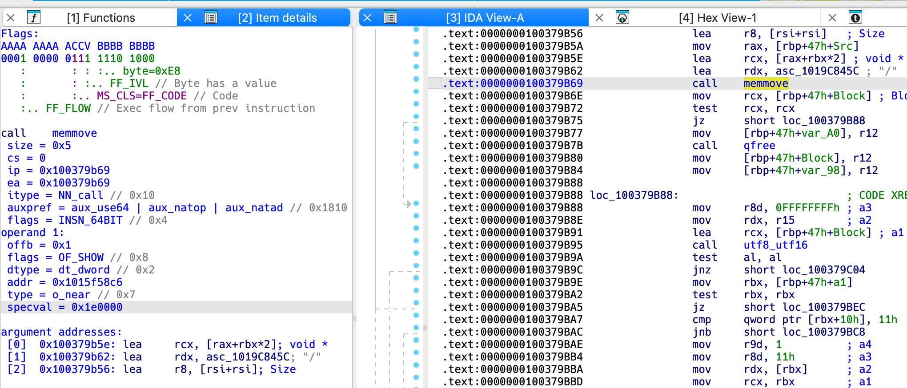
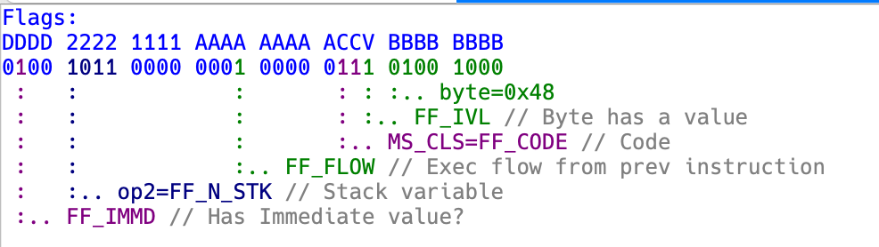
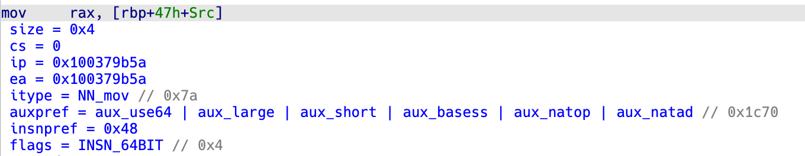
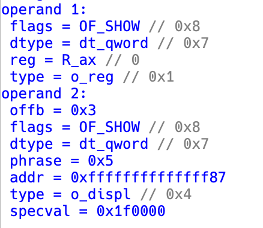
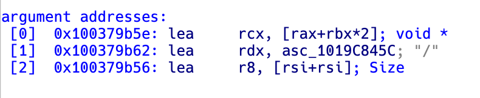
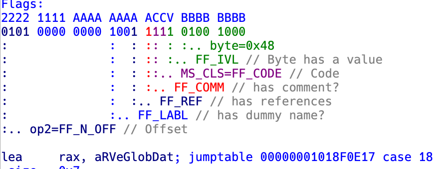
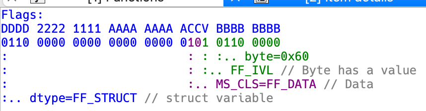
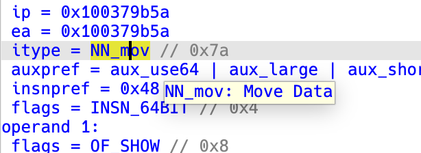
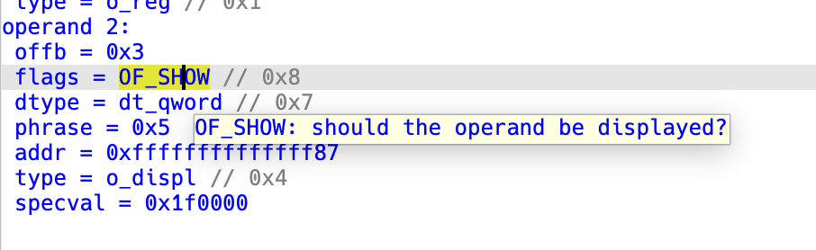
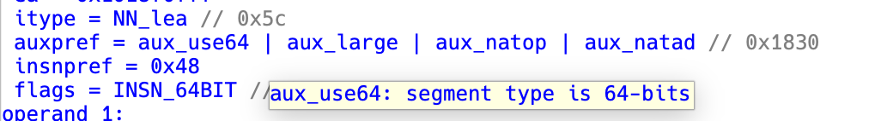

# Decode Instruction Plugin


The Decode Instruction plugin is an IDA Pro plugin that provides detailed information about the instruction at the current cursor position. The plugin displays comprehensive instruction details including:

- **Flags dissection** - Visual breakdown of instruction flags with color-coded bit fields

- **Instruction information** - Size, address, type, and encoding details


- **Operand details** - Type, value, registers, addresses, and special flags for each operand

- **Argument addresses** - Resolved argument addresses when available

## Installation

To install the Decode Instruction plugin, follow these steps:

1. Copy the `decode_instruction.(dll|so|dylib)` file to the IDA plugins (`idaapi.get_ida_subdirs("plugins")`) folder.
2. Launch IDA Pro.
3. Navigate to the `Edit/Plugins` menu.
4. Choose `Decode Instruction` from the list of plugins.

The plugin will open a custom viewer showing detailed information about the instruction at the current cursor position.

## Building the Plugin

To build the Decode Instruction plugin, you will need to use the [ida-cmake](https://github.com/allthingsida/ida-cmake) build system.

Please refer to the ida-cmake documentation for instructions on how to set up and use the build system.

Once you have set up the ida-cmake build system, you can build the plugin by running the following commands:

```bash
git clone https://github.com/milankovo/decode_instruction
cd decode_instruction
./prepare.sh
```

Or manually:

```bash
cmake -B build -DEA64=YES -S src/
cmake --build build --config Release
```

Note: The Decode Instruction plugin is compatible with IDA Pro 9.2. While it has been tested with this version, it might be possible to use it with previous versions of IDA Pro.

## Features

- **Real-time updates** - The viewer automatically updates when you navigate to different instructions
- **Visual flag dissection** - Flags are displayed as binary with color-coded bit groups and explanations


- **Architecture support** - Supports multiple architectures including x86, ARM, and many others

- **Interactive hints** - Hover over fields to see detailed descriptions


- **Double-click navigation** - Double-click on addresses to jump to them

